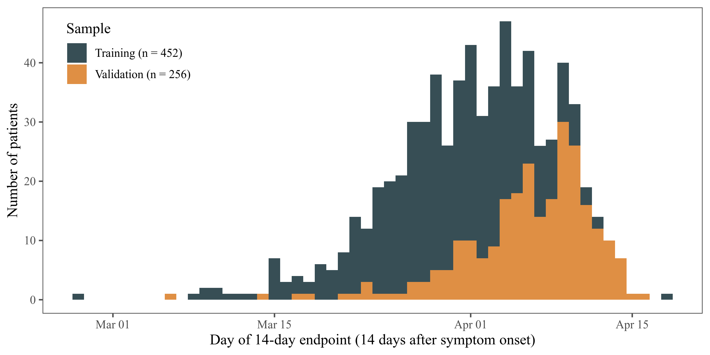

# Supplementing the National Early Warning Score (NEWS2) for anticipating early deterioration among patients with COVID-19 infection

Ewan Carr<sup>\*</sup>, Rebecca Bendayan<sup>\*</sup>, Daniel Bean, Kevin O'Gallagher, Andrew Pickles,
Daniel Stahl, Rosita Zakeri, Thomas Searle, Anthony Shek, Zeljko Kraljevic,
James T Teo<sup>\#</sup>, Ajay Shah<sup>\#</sup>, Richard Dobson<sup>\#</sup>
doi: [2020.04.24.20078006](https://doi.org/10.1101/2020.04.24.20078006)

<sup>\*\#</sup>Joint authors


## Overview

* This repository provides pre-trained models to validate models in the
  [medRxiv
  pre-print](https://www.medrxiv.org/content/10.1101/2020.04.24.20078006v2). 
* Please get in touch if you would like to collaborate on this replication
  (clinical contact: <a
  href="&#109;&#97;&#105;&#108;&#116;&#111;&#58;&#106;&#97;&#109;&#101;&#115;&#116;&#101;&#111;&#64;&#110;&#104;&#115;&#46;&#110;&#101;&#116;">&#106;&#97;&#109;&#101;&#115;&#116;&#101;&#111;&#64;&#110;&#104;&#115;&#46;&#110;&#101;&#116;</a>;
  technical: <a
  href="&#109;&#97;&#105;&#108;&#116;&#111;&#58;&#101;&#119;&#97;&#110;&#46;&#99;&#97;&#114;&#114;&#64;&#107;&#99;&#108;&#46;&#97;&#99;&#46;&#117;&#107;">&#101;&#119;&#97;&#110;&#46;&#99;&#97;&#114;&#114;&#64;&#107;&#99;&#108;&#46;&#97;&#99;&#46;&#117;&#107;</a>).
* If you use code/trained models from this repository, please cite the
  pre-print as a condition of use.


# How to use this repository

The file [`replicate.py`](replicate.py) will fit a series of models using
pre-trained models. Specifically, it:

1. Imports a CSV file containing the required features and outcome.
2. For each feature set, it loads a pre-trained model (see
   [here][training/trained_models]) and tests this on the new data.

Some notes:

* The code does not perform any training or cross-validation, with the
  exception of KNN imputation, see [below](#missing-data).
* Some code for data cleaning is provided ([`cleaning.R`](cleaning.R)) but this
  is quite specific to the structure of the source data. It should demonstrate
  how we prepared the training and validation datasets, but will likely require
  modification before running on replication samples.

## Setup

* All models are written in Python using
  [scikit-learn](https://scikit-learn.org/stable/). A minimal set of packages
  is required (`pandas`, `numpy`, `scikit-learn`; see
  [`requirements.txt`](software/requirments.txt)).
* The recommended way to use this repo is in a virtual environment. If you’re
  using `conda`, you can use:

  ```{bash}
  conda env create -f conda.yml
  ```
* If you're using Singularity, you can use:

  ```{bash}
  singularity build python.simg singularity.def
  ```
See `conda.yml` and `singularity.def` in the [`software`](software) folder.

## Simulated data

We have provided some simulated data for testing purposes
([`simulated.csv`](simulated.csv)). This is randomly generated data based on
the means/SD of the training sample. For example, you can fit all models to the
simulated dataset:

```bash
git clone https://github.com/ewancarr/NEWS2-COVID-19
cd NEWS2-COVID-19
conda env create -f software/conda.yml
conda activate news2
python replicate.py
```

## Required measures

* The `replicate.py` script requires a dataset (`validation.csv`) containing
  the measures in the table below.
* Not all columns are required for replication.
    * At a minimum, you need: `y`, `age`, `news2`, `crp_sqrt`, `neutrophils`,
      `estimatedgfr`, and `albumin`. 
    * This would allow validation of the supplemented NEWS2 score model from
      the paper (i.e. Models 1 and 5 from Table 3, p. 19).

|                          | Column              | Measure                                       | Transformation |
|--------------------------|---------------------|-----------------------------------------------|----------------|
| Outcome                  | `y`                 | Binary 14-day ICU/death outcome               | None           |
| Demographics             | `age`               | Age at admission in years                     | None           |
|                          | `male`              | Sex (0 = Female; 1 = Male)                    | None           |
| Blood parameters         | `crp_sqrt`          | C-reative protein (CRP; mg/L)                 | `np.sqrt`      |
|                          | `creatinine`        | Creatinine (µmol/L)                           | None           |
|                          | `albumin`           | Albumin (g/L)                                 | None           |
|                          | `estimatedgfr`      | Estimated Glomerular Filtration Rate (mL/min) | None           |
|                          | `alt`               | ALT                                           | None           |
|                          | `troponint`         | Troponin T (ng/L)                             | None           |
|                          | `ferritin`          | Ferritin (ug/L)                               | None           |
|                          | `lymphocytes_log10` | Lymphocyte count (x 10<sup>9</sup>)           | `np.log10`     |
|                          | `neutrophils`       | Neutrophil count (x 10<sup>9</sup>)           | None           |
|                          | `plt`               | Platelet count (x 10<sup>9</sup>)             | None           |
|                          | `nlr_log10`         | Neutrophil-to-lymphocyte ratio                | `np.log10`     |
|                          | `lymph_crp_log`     | Lymphocyte-to-CRP ratio                       | `np.log`       |
|                          | `hb`                | Haemoglobin (g/L)                             | None           |
| Physiological parameters | `news2`             | NEWS2 total score                             | None           |
|                          | `temp`              | Temperature (°C)                              | None           |
|                          | `oxsat`             | Oxygen saturation (%)                         | None           |
|                          | `resp`              | Respiratory rate (breaths per minute)         | None           |
|                          | `hr`                | Heart rate (beats/min)                        | None           |
|                          | `sbp`               | Systolic blood pressure (mmHg)                | None           |
|                          | `dbp`               | Diastolic blood pressure                      | None           |
|                          | `gcs_score`         | Glasgow Coma Scale total score                | None           |

## Cohort selection

The study cohort was defined as:

* All adult inpatients testing positive for SARS-Cov2 by reverse transcription
  polymerase chain reaction (RT-PCR);
* all patients included in the study had symptoms consistent with COVID-19
  disease (e.g. cough, fever, dyspnoea, myalgia, delirium).
* We excluded subjects who were seen in the emergency department but not
  admitted. 

## Timing

* The training sample included patients testing positive for SARS-Cov2 between
  1<sup>st</sup> and 30<sup>th</sup> March 2020. The external validation sample
  included patients testing positive on/after 31<sup>st</sup> March 2020.
* Where possible, these timeframes should be used in replications.



## Outcome

The primary outcome (`y`) was patient status at 14 days after symptom onset, or
admission to hospital where symptom onset was missing, categorised as:

1. Hospital admission but no transfer to ICU or death (WHO-COVID-19 Outcome
   Scale 3-5; `y` = 0)
2. Transfer to ICU or death (WHO-COVID-19 Outcome Scales 6-8; `y` = 1)

If date of symptom onset is unavailable it may be necessary to impute or use
date of hospital admission. Most endpoints happen at 10-14 days, so you may
have to work out how to define this.

## Feature sets

Please refer to the [above](#required-measures) table for details of the
required measures. The aim of this analysis is to assess the improvement in
predictive performance achieved by supplementing NEWS2 with a small number of
blood/physiological parameters. The base model includes:

    age, news2, crp, neutrophils, estimatedgfr, albumin

A secondary model, if data are available, additionally includes:

    oxsat, troponint, lymphocytes_log10

The provided script ([`replicate.py`](replicate.py)) includes several other
feature sets which can be estimated subject to data availability.

All features must be measured at or shortly after hospital admission (within
24 hours).

## Missing data

* During training, missing feature information was imputed using KNN imputation
  ([`sklearn.impute.KNNImputer`](https://scikit-learn.org/stable/modules/generated/sklearn.impute.KNNImputer.html)). 
* For the purposes of temporal external validation, as presented in the paper,
  we used fitted imputation model to impute in the validation dataset.
* However, this repository does not provide the pre-trained KNN model, since
  the fitted object contains data that cannot be shared publicly.  
* Therefore, [`replicate.py`](replicate.py) will train the KNN imputation on
  the provided validation dataset (see [here](replicate.py#L109-L110)).

# Descriptive statistics, by outcome

The below table can be used to compare/comment on differences between training
and replication samples.

|                                | N     | All patients      | No ICU/death<br> (n=393) | ICU/death<br> (n=159) |
|--------------------------------|-------|-------------------|--------------------------|-----------------------|
| Age                            | 452   | 67.00 [28.00]     | 64.87 [30.00]            | 70.92 [27.00]         |
| Sex (male) N (%)               | 452   | 248 (54.9%)       | 157 (53.6%)              | 91 (57.2%)            |
| Ethnicity - BAME N (%)         | 285   | 120 (42.1%)       | 73 (41.0%)               | 47 (43.9%)            |
| **Comorbidities**              | **N** |                   | **N (%)**                |                       |
| Hypertension                   | 452   | 243 (53.8%)       | 147 (50.2%)              | 96 (60.4%)            |
| Diabetes mellitus              | 452   | 154 (34.1%)       | 93 (31.7%)               | 61 (38.4%)            |
| Heart Failure                  | 452   | 57 (12.6%)        | 32 (10.9%)               | 25 (15.7%)            |
| Ischaemic Heart Diseases       | 452   | 85 (18.8%)        | 55 (18.8%)               | 30 (18.9%)            |
| COPD                           | 452   | 48 (10.6%)        | 27 (9.2%)                | 21 (13.2%)            |
| Asthma                         | 452   | 65 (14.4%)        | 44 (15.0%)               | 21 (13.2%)            |
| Chronic Kidney Disease         | 452   | 84 (18.6%)        | 46 (15.7%)               | 38 (23.9%)            |
| **Blood biomarkers**           | **N** |                   | **Mean [IQR]**           |                       |
| Albumin                        | 322   | 37.11 [7.00]      | 38.05 [7.00]             | 35.48 [7.00]          |
| Alanine aminotransferase (ALT) | 184   | 54.83 [33.00]     | 60.34 [30.50]            | 46.45 [34.00]         |
| C-reactive protein (CRP)       | 419   | 93.55 [106.70]    | 72.99 [84.90]            | 130.41 [135.62]       |
| Creatinine                     | 420   | 121.67 [49.00]    | 105.86 [40.50]           | 150.42 [72.00]        |
| Estimated GFR                  | 334   | 63.75 [40.00]     | 68.01 [36.00]            | 56.05 [44.50]         |
| Ferritin                       | 122   | 1356.01 [1165.25] | 1272.35 [1149.75]        | 1442.45 [902.50]      |
| Haemoglobin                    | 419   | 125.05 [30.00]    | 125.52 [30.00]           | 124.21 [28.75]        |
| Lymphocyte count               | 419   | 1.45 [0.67]       | 1.10 [0.69]              | 2.09 [0.67]           |
| Neutrophil count               | 418   | 5.72 [3.53]       | 5.06 [3.01]              | 6.91 [5.31]           |
| Neutrophil/lymphocyte ratio    | 418   | 6.80 [5.01]       | 5.81 [4.22]              | 8.58 [6.26]           |
| Lymphocyte/CRP ratio           | 416   | 0.07 [0.04]       | 0.08 [0.05]              | 0.05 [0.02]           |
| Platelet count                 | 421   | 226.68 [103.00]   | 228.34 [102.50]          | 223.69 [104.25]       |
| Troponin T                     | 141   | 33.92 [29.00]     | 30.40 [26.00]            | 37.92 [38.50]         |
| **Physiological parameters**   | **N** |                   | **Mean [IQR]**           |                       |
| NEWS2 Total Score              | 401   | 2.51 [3.00]       | 2.10 [3.00]              | 3.40 [4.00]           |
| Heart rate                     | 405   | 85.35 [20.00]     | 84.49 [19.00]            | 87.15 [23.50]         |
| Oxygen saturation              | 404   | 96.22 [3.00]      | 96.54 [2.00]             | 95.56 [3.00]          |
| Respiration rate               | 405   | 19.84 [2.00]      | 19.42 [2.00]             | 20.72 [3.00]          |
| GCS score                      | 172   | 14.12 [1.00]      | 14.20 [1.00]             | 13.95 [1.00]          |
| Systolic blood pressure        | 405   | 127.39 [29.00]    | 127.09 [26.50]           | 128.00 [32.00]        |
| Diastolic blood pressure       | 405   | 72.69 [18.00]     | 73.20 [18.00]            | 71.63 [19.00]         |
| Temperature                    | 405   | 37.12 [0.90]      | 37.12 [0.90]             | 37.11 [1.00]          |
