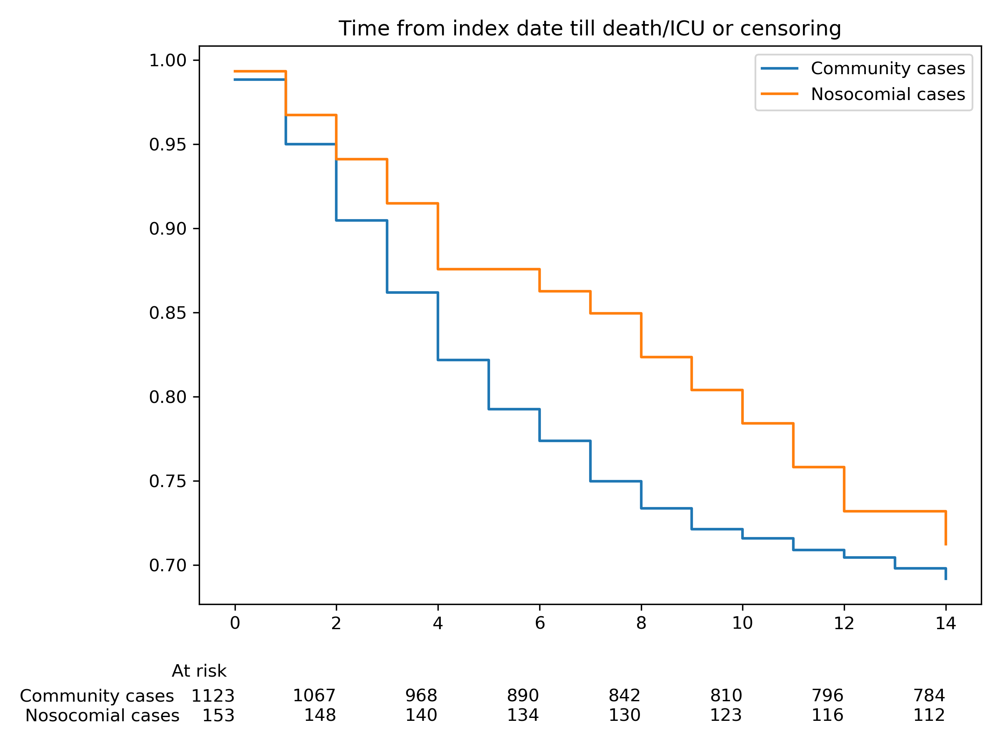

# Evaluation and Improvement of the National Early Warning Score (NEWS2) for COVID-19: a multi-hospital study

> Ewan Carr<sup>\*</sup>, Rebecca Bendayan<sup>\*</sup>, Daniel Bean, Matthew
> Stammers, Wenjuan Wang, Huayu Zhang, Thomas Searle, Zeljko Kraljevic, Anthony
> Shek, Hang T T Phan, Walter Muruet, Anthony J Shinton, Ting Shi, Xin Zhang,
> Andrew Pickles, Daniel Stahl, Rosita Zakeri, Kevin O'Gallagher, Amos Folarin,
> Lukasz Roguski, Florina Borca, James Batchelor, Xiaodong Wu, Jiaxing Sun,
> Ashwin Pinto, Bruce Guthrie, Cormac Breen, Abdel Douiri, Honghan Wu, Vasa
> Curcin, James T Teo<sup>\#</sup>, Ajay Shah<sup>\#</sup>, Richard
> Dobson<sup>\#</sup>  

<sup>\*\#</sup>Joint authors

doi: [2020.04.24.20078006](https://doi.org/10.1101/2020.04.24.20078006)

## Overview

* This repository provides pre-trained models to validate models in the
  [medRxiv pre-print][medrxiv].
* Please get in touch if you would like to collaborate on this replication.
    * Clinical contact: <a
  href="&#109;&#97;&#105;&#108;&#116;&#111;&#58;&#106;&#97;&#109;&#101;&#115;&#116;&#101;&#111;&#64;&#110;&#104;&#115;&#46;&#110;&#101;&#116;">&#106;&#97;&#109;&#101;&#115;&#116;&#101;&#111;&#64;&#110;&#104;&#115;&#46;&#110;&#101;&#116;</a>
   * Technical contact: <a
  href="&#109;&#97;&#105;&#108;&#116;&#111;&#58;&#101;&#119;&#97;&#110;&#46;&#99;&#97;&#114;&#114;&#64;&#107;&#99;&#108;&#46;&#97;&#99;&#46;&#117;&#107;">&#101;&#119;&#97;&#110;&#46;&#99;&#97;&#114;&#114;&#64;&#107;&#99;&#108;&#46;&#97;&#99;&#46;&#117;&#107;</a>
* If you use code/trained models from this repository, please cite the
  pre-print as a condition of use.


[medrxiv]: https://www.medrxiv.org/content/10.1101/2020.04.24.20078006v3

## How to use this repository

The file [`replicate.py`](replicate.py) validates four models that were
initially trained on the KCH sample. The four models are:

<table>
<thead>
  <tr>
    <th>Endpoint</th>
    <th>Model</th>
    <th>Included features</th>
  </tr>
</thead>
<tbody>
  <tr>
    <td rowspan="2">3-day ICU/death</td>
    <td>1</td>
    <td>NEWS2, oxygen litres</td>
  </tr>
  <tr>
    <td>2</td>
    <td>NEWS2 only</td>
  </tr>
  <tr>
    <td rowspan="2">14-day ICU/death</td>
    <td>3</td>
    <td>NEWS2, oxygen litres, urea, age, oxygen saturation, CRP, estimated GFR, neutrophils, platelets, neutrophil/lymphocyte ratio</td>
  </tr>
  <tr>
    <td>4</td>
    <td>NEWS2 only</td>
  </tr>
</tbody>
</table>

The script imports a validation dataset (`validation.csv`) or generates a
simulated dataset if this is missing. For each model (1-4), we:

1. Evaluate discrimination of the pre-trained models (loaded from
   [`pretrained.joblib`](pretrained.joblib)) in the validaton dataset.
2. Generate estimates needed for calibration plots;
3. Test re-calbrated models, based on:
    * Shrinkage factors derived from internal validation;
    * Recalibration in the validation sample, based on [Platt's method][plat].
4. The estimates are then saved (using `joblib.dump`). 

Some notes:

* The code does not perform any training or cross-validation, with the
  exception of KNN imputation, see [below](#missing-data).
* Some code for data cleaning is provided ([`cleaning.R`](cleaning.R)) but this
  is quite specific to the structure of the source data. It should demonstrate
  how we prepared the training and validation datasets, but will likely require
  modification before running on replication samples.

[plat]: https://scikit-learn.org/stable/modules/calibration.html#usage


## Measures needed to validate these models

### Outcomes 

* We're using a combined outcome of transfer to ICU or death (WHO-COVID-19
  Outcomes Scales 6-8) within 3 or 14 days following index date.
    * For non-nosocomial patients (i.e. community-acquired COVID infection)
      index date is hospital admission.
    * For nosocomial patients index date is the date of symptom onset. If onset
      is unavailable the date of diagnosis (positive SARS-CoV-2 RT-PCR) minus 4
      days can be used instead.
* Each outcome is coded as 1 if the patient was transferred to ICU or died
  within the period (3 days or 14 days, respectively); 0 otherwise. All
  patients not experiencing the outcome must have reached the respective
  endpoint.

In the KCH training sample (n=1276) the event rates were as follows:

|                  | N (%)       |
|------------------|-------------|
| 3-day ICU/death  | 163 (12.8%) |
| 14-day ICU/death | 389 (30.5%) |

The time-to-event is shown below:




### Features

The 10 required features are listed below:

|                            | Column            | Measure                                         | Transformation   |
| -------------------------- | ----------------- | ----------------------------------------------- | ---------------- |
| Demographics               | `age`             | Age at admission in years                       | None             |
| Blood parameters           | `crp`             | C-reative protein (CRP; mg/L)                   | `np.sqrt`        |
|                            | `estimatedgfr`    | Estimated Glomerular Filtration Rate (mL/min)   | None             |
|                            | `neutrophils`     | Neutrophil count (x 10<sup>9</sup>)             | `np.sqrt`        |
|                            | `plt`             | Platelet count (x 10<sup>9</sup>)               | None             |
|                            | `nlr`             | Neutrophil-to-lymphocyte ratio                  | `np.log`         |
|                            | `urea`            | Urea (mmol/L)                                   | `np.sqrt`        |
| Physiological parameters   | `news2`           | NEWS2 total score                               | None             |
|                            | `oxsat`           | Oxygen saturation (%)                           | None             |
|                            | `oxlt`            | Oxygen litres                                   | None             |

#### Important

* All features must be measured within 48 hours of index date (hospital
  admission or symptom onset).
* Before any transformations, all continuous features must be
  [winsorized](https://en.wikipedia.org/wiki/Winsorizing) by setting the
  top/bottom 1% of values to the 1st and 99th percentile values. Python code
  to achieve this can be found in [`cleaning.py`](cleaning.py):

    ```python
    to_trim = ['crp', 'estimatedgfr', 'neutrophils', 'plt', 'urea', 'nlr', 'oxsat', 'oxlt', 'news2']

    df[to_trim] = df[to_trim].clip(lower=df[to_trim].quantile(0.01),
                                   upper=df[to_trim].quantile(0.99),
                                   axis=1)
    ```
* Some features (`crp`, `neutrophils`, `nlr`, `urea`) require transformation, 
  as summarised in the table.

## Cohort selection 

* The training sample was defined as all adult inpatients testing positive for
  SARS-Cov2 by reverse transcription polymerase chain reaction (RT-PCR);

* All patients included in the study had symptoms consistent with COVID-19
  disease (e.g. cough, fever, dyspnoea, myalgia, delirium).

* We excluded subjects who were seen in the emergency department but not
  admitted. 

* The training sample included patients testing positive for SARS-Cov2 between
  1<sup>st</sup> and 30<sup>th</sup> April 2020. 

## Software environment

* Data cleaning and training was performed in Python 3.8.2 using
  [scikit-learn](https://scikit-learn.org/stable/). A minimal set of packages
  is required (`pandas`, `numpy`, `scikit-learn`; see
  [`requirements.txt`](requirments.txt)).

    ```
    joblib==0.14.1
    matplotlib==3.1.3
    numpy==1.18.1
    pandas==1.0.3
    scikit-learn==0.23.1
    scipy==1.4.1
    statsmodels==0.11.1
    ```
    
* For testing purposes, `replicate.py` will generate simulated data if a
  validation is not provided. These values are randomly generated and are not
  representative of the training dataset.

* To test all models on the simulated dataset:

    ```bash
    git clone https://github.com/ewancarr/NEWS2-COVID-19
    cd NEWS2-COVID-19
    pip install -r software/requirements.txt
    python replicate.py
    ```

## Missing data

* During training, missing feature information was imputed using KNN imputation
  ([`sklearn.impute.KNNImputer`](https://scikit-learn.org/stable/modules/generated/sklearn.impute.KNNImputer.html)). 
* However, this repository does not provide the pre-trained KNN model, since
  the fitted object contains data that cannot be shared publicly.  
* Therefore, [`replicate.py`](replicate.py) will train the KNN imputation on
  the provided validation dataset (see
  [here](https://github.com/ewancarr/NEWS2-COVID-19/blob/a6ef31bd17210492c693b442dbeade5b76c21efb/replicate.py#L49)).
